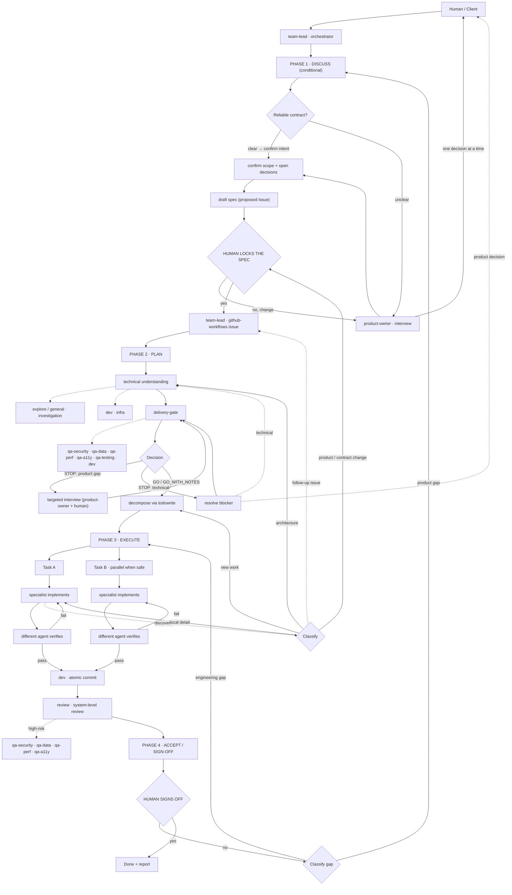

# Agent Workflow — How the Team Processes a Request

How the OpenCode agents work together, end to end, for the two ways a request
can enter the system: an **existing GitHub issue** or a **vague description**.

The team runs through **four phases with two human control points**:

```text
discuss  →  plan  →  execute  →  accept
   │           │                    │
   └ clarity   └ human locks       └ human signs off
     triage      the spec
```

---

## The Graph



---

## The Two Intake Paths

Both paths run through **Phase 1 (Discuss) and end at the same control point:
the human locks the spec.** The discussion is **conditional** — it happens only
when the request does not already provide a reliable contract.

### Path A — Existing GitHub issue (clear)

1. **team-lead** inspects the issue.
2. If the issue is **precise, current, and represents the requested work**, no
   interview is needed: team-lead confirms intent with the human and surfaces
   any open product decision.
3. If it is **vague, incomplete, contradictory, or outdated** → hand it to
   **product-owner** for a targeted interview.
4. **product-owner** asks only the high-leverage questions needed to remove
   ambiguity, then proposes an improved issue.
5. **Human locks the spec** (or requests changes → back to product-owner).
6. **team-lead** updates the issue (github-workflows skill) with the locked wording.
7. Proceed to Phase 2 (plan).

### Path B — Vague description (interview)

1. **Human** gives team-lead a vague request (e.g. *"I want auth to be
   pluggable"*).
2. **team-lead** does **not** decompose it into tasks. It runs the interview,
   delegating to **product-owner**.
3. **product-owner** interrogates the human one decision at a time, starting
   with the highest-impact ambiguity, and makes low-risk assumptions rather
   than over-asking.
4. **product-owner** produces a **draft spec / proposed GitHub issue** (Summary
   / Goal / Scope / Non-goals / Requirements / Acceptance Criteria / Open
   Questions / Constraints).
5. **Human locks the spec**.
6. **team-lead** creates the issue (github-workflows skill).
7. The issue is now the **locked engineering contract** → proceed to Phase 2.

> Both paths converge on the same rule: **the GitHub issue is the
> authoritative, human-locked contract.** A vague request is never
> implemented directly — it is first discussed, then locked.

---

## The Shared Engineering Pipeline

### Phase 1 — Discuss (conditional)

Every request is triaged for clarity. A request with a reliable contract
(existing precise issue, or written request with scope + behavior + acceptance
criteria) goes straight to intent-confirmation and the lock. Only an **unclear**
request gets a product-owner interview. Output: a **draft spec**. The phase ends
when the **human locks the spec** — the control point that allows planning to
start.

### Phase 2 — Plan

#### 1. Technical understanding

team-lead delegates investigation to the minimum set of capabilities required:
`explore`/`general` for repository and architecture analysis, domain
specialists for stack-specific facts. Evidence from the repo wins over
assumptions.

#### 2. Delivery gate

`delivery-gate` decides **GO / GO_WITH_NOTES / STOP** (default: GO).

- **GO / GO_WITH_NOTES** → team-lead proceeds to planning, carrying the notes
  into task definitions.
- **STOP (product-contract gap)** → team-lead routes a **targeted interview**
  (product-owner + human) for the specific gap, then re-runs the gate. Loop
  until the gate returns GO or GO_WITH_NOTES.
- **STOP (technical)** → resolve the blocker first: a product decision goes to
  the human, a technical problem goes back to investigation or a specialist. It
  does not create ten tasks before confirming the design is valid.

The gate may call specialists for evidence (`qa-security`, `qa-data`, `qa-perf`,
`qa-a11y`, `qa-testing`, `dev-*`, `infra`) but owns
the final decision. It does not mutate the GitHub issue.

#### 3. Decomposition

team-lead turns the locked feature into tasks, tracked via `todowrite`.
Rules: **one task = one coherent change = one specialist = one verification =
one atomic commit**. Tasks form a dependency graph; independent tasks run in
parallel when safe, dependent tasks run in order.

### Phase 3 — Execute

#### 4. Implement

Each task is delegated to the matching specialist:

| Concern            | Agent / skill    |
| ------------------ | ---------------- |
| Node / TypeScript  | `dev`            |
| React / frontend   | `dev`            |
| Infra (Docker / Terraform / Auth0 / Render / CDK) | `infra`        |
| GitHub operations  | `github-workflows` skill |

#### 5. Verify

Implementation and verification are **separate responsibilities** — a
different agent verifies each task (typecheck, lint, unit/integration/E2E,
security, data, perf, a11y, as appropriate to risk). On failure: keep the task
incomplete, send it back to the implementer, re-verify, iterate until green.

#### 6. Commit

Only verified code is committed. **dev** loads the `github-workflows`
skill and performs the atomic commit with a
conventional message (`feat(auth): add role repository`). One task → one
meaningful commit. Unrelated changes never leak into a task's commit.

#### 7. System review

When all tasks are done, `review` performs a system-level review of the whole
change (correctness, architecture, integration, scope creep, maintainability).
High-risk features add a domain review (`qa-security`, `qa-data`, `qa-perf`,
`qa-a11y`).

### Phase 4 — Accept (sign-off)

#### 8. Human sign-off

Before presenting for sign-off, **team-lead** closes the workflow: if the work
belongs on a branch for review, it opens the pull request (github-workflows
skill, `gh pr create`); otherwise the commits stay on the target branch. Then
team-lead presents the result (what changed, files affected, verification,
commits, decisions) and obtains the human's **explicit acceptance**. A rejection
is classified and routed back: a **product gap** returns to Phase 1 (re-lock the
spec), an **engineering gap** returns to Phase 3. Work is done only when the
human signs off.

---

## The Issue Is a Locked Contract

Discoveries during investigation or implementation never silently change the
issue.

- **Execution metadata** (progress, commit refs, PR refs, status) → updated
  freely.
- **Semantic changes** (behavior, scope, acceptance criteria, contracts,
  security/data semantics) → team-lead evaluates impact → **human re-locks the
  spec** → **team-lead** updates the issue (github-workflows skill) → work resumes.
- **Out-of-scope discoveries** → proposed as a separate follow-up issue, never
  absorbed into the current one.

---

## Who Owns What

| Agent            | Owns                                             | Does NOT own                              |
| ---------------- | ------------------------------------------------ | ----------------------------------------- |
| `team-lead`      | orchestration, discuss, planning, tracking, gates| implementation, commits, product decisions|
| `product-owner`  | interview / product clarity → draft spec         | architecture, implementation             |
| `delivery-gate`  | feasibility decision (GO/GO_WITH_NOTES/STOP)     | implementation, issue mutation           |
| specialists      | implementation of locked tasks                   | redefining scope or architecture         |
| `github-workflows` | issue/PR/commit/release mutations (skill)      | product or engineering decisions         |
| `review` / `qa-*`| independent verification and review              | writing code or tests                    |
| **Human**        | what to build, lock the spec, sign off           | implementation mechanics                 |

The core traceability chain:

```
Human Intent → Discussed Spec → Locked Spec → Technical Decision → Task → Code → Verification → Atomic Commit → Review → Human Sign-off
```
