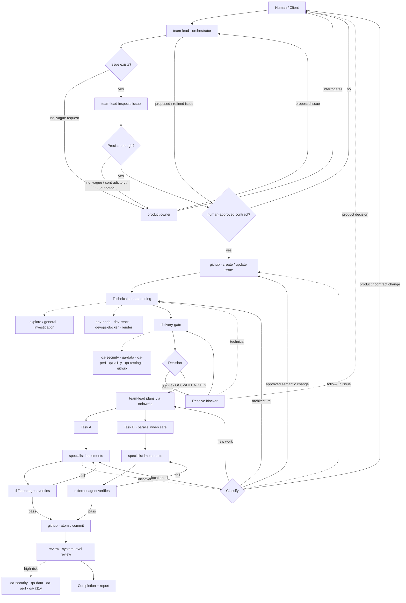

# Agent Workflow — How the Team Processes a Request

How the OpenCode agents work together, end to end, for the two ways a request
can enter the system: an **existing GitHub issue** or a **vague description**.

---

## The Graph



---

## The Two Intake Paths

### Path A — Existing GitHub issue

1. **team-lead** inspects the issue.
2. If it is **clear enough** and still represents the requested work → straight to
   technical understanding.
3. If it is **vague, incomplete, contradictory, or outdated** → hand it to
   **product-owner** to refine.
4. **product-owner** asks only the high-leverage questions needed to remove
   ambiguity, then proposes an improved issue.
5. **Human** approves the refined contract (or requests changes → back to
   product-owner).
6. **github** updates the issue with the approved wording.
7. Proceed to technical understanding.

### Path B — Vague description

1. **Human** gives team-lead a vague request (e.g. *"I want auth to be
   pluggable"*).
2. **team-lead** does **not** decompose it into tasks. It delegates to
   **product-owner**.
3. **product-owner** interrogates the human one decision at a time, starting
   with the highest-impact ambiguity, and makes low-risk assumptions rather
   than over-asking.
4. **product-owner** produces a **proposed GitHub issue** (Summary / Goal /
   Scope / Non-goals / Requirements / Acceptance Criteria / Open Questions /
   Constraints).
5. **Human** approves the proposed issue.
6. **github** creates the issue.
7. The issue is now the **engineering contract** → proceed to technical
   understanding.

> Both paths converge on the same rule: **the GitHub issue is the
> authoritative, human-approved contract.** A vague request is never
> implemented directly — it is first turned into an approved issue.

---

## The Shared Engineering Pipeline

### 1. Technical understanding

team-lead delegates investigation to the minimum set of capabilities required:
`explore`/`general` for repository and architecture analysis, domain
specialists for stack-specific facts. Evidence from the repo wins over
assumptions.

### 2. Delivery gate

`delivery-gate` decides **GO / GO_WITH_NOTES / STOP** (default: GO).

- **GO / GO_WITH_NOTES** → team-lead proceeds to planning, carrying the notes
  into task definitions.
- **STOP** → resolve the blocker first: a product decision goes to the human,
  a technical problem goes back to investigation or a specialist. It does not
  create ten tasks before confirming the design is valid.

The gate may call specialists for evidence (`qa-security`, `qa-data`, `qa-perf`,
`qa-a11y`, `qa-testing`, `dev-*`, `devops-docker`, `render`, `github`) but owns
the final decision. It does not mutate the GitHub issue.

### 3. Plan

team-lead turns the approved feature into tasks, tracked via `todowrite`.
Rules: **one task = one coherent change = one specialist = one verification =
one atomic commit**. Tasks form a dependency graph; independent tasks run in
parallel when safe, dependent tasks run in order.

### 4. Implement

Each task is delegated to the matching specialist:

| Concern            | Agent            |
| ------------------ | ---------------- |
| Node / TypeScript  | `dev-node`       |
| React / frontend   | `dev-react`      |
| Docker / infra     | `devops-docker`  |
| Deployment         | `render`         |
| GitHub operations  | `github`         |

### 5. Verify

Implementation and verification are **separate responsibilities** — a
different agent verifies each task (typecheck, lint, unit/integration/E2E,
security, data, perf, a11y, as appropriate to risk). On failure: keep the task
incomplete, send it back to the implementer, re-verify, iterate until green.

### 6. Commit

Only verified code is committed. **github** performs the atomic commit with a
conventional message (`feat(auth): add role repository`). One task → one
meaningful commit. Unrelated changes never leak into a task's commit.

### 7. System review

When all tasks are done, `review` performs a system-level review of the whole
change (correctness, architecture, integration, scope creep, maintainability).
High-risk features add a domain review (`qa-security`, `qa-data`, `qa-perf`,
`qa-a11y`).

### 8. Completion

Report: what changed, files affected, verification results, commits, decisions,
and genuine remaining concerns.

---

## The Issue Is a Living Contract

Discoveries during investigation or implementation never silently change the
issue.

- **Execution metadata** (progress, commit refs, PR refs, status) → updated
  freely.
- **Semantic changes** (behavior, scope, acceptance criteria, contracts,
  security/data semantics) → team-lead evaluates impact → **human approval** →
  **github** updates the issue → work resumes.
- **Out-of-scope discoveries** → proposed as a separate follow-up issue, never
  absorbed into the current one.

---

## Who Owns What

| Agent            | Owns                                             | Does NOT own                              |
| ---------------- | ------------------------------------------------ | ----------------------------------------- |
| `team-lead`      | orchestration, planning, tracking, gatekeeping   | implementation, commits, product decisions|
| `product-owner`  | product clarity → proposed issue                 | architecture, implementation             |
| `delivery-gate`  | feasibility decision (GO/GO_WITH_NOTES/STOP)     | implementation, issue mutation           |
| specialists      | implementation of approved tasks                 | redefining scope or architecture         |
| `github`         | issue/PR/commit/release mutations                | product or engineering decisions         |
| `review` / `qa-*`| independent verification and review              | writing code or tests                    |
| **Human**        | what to build, scope, product trade-offs         | implementation mechanics                 |

The core traceability chain:

```
Human Intent → Approved Issue → Technical Decision → Task → Code → Verification → Atomic Commit → Review
```
